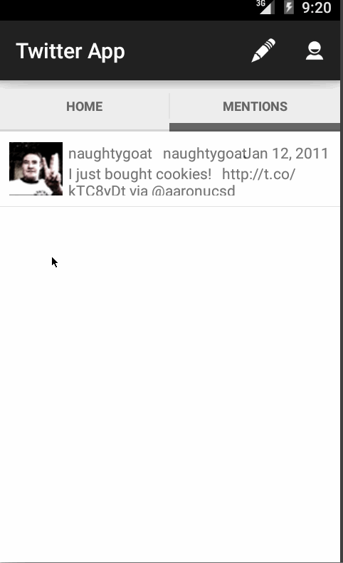

# Android CodePath Week 3 & week 4: My Simple Tweet app

Version 2

Overview: Build a simple Twitter client that supports viewing a Twitter timeline and composing a new tweet.

Time spent: 18 hours spent in total

Quick manual notes of app usage:

1) The following user stories must be completed:
- User can sign in to Twitter using OAuth login

- User can view the tweets from their home timeline

- User should be displayed the username, name, and body for each tweet
- User should be displayed the relative timestamp for each tweet "8m", "7h"
- User can view more tweets as they scroll with infinite pagination

2) User can compose a new tweet:
- User can click a “Compose” icon in the Action Bar on the top right
- User can then enter a new tweet and post this to twitter
- User is taken back to home timeline with new tweet visible in timeline

3) (WEEK4) Includes all required user stories from Week 3 Twitter Client (above) plus:
- User can switch between Timeline and Mention views using tabs.
- User can view their home timeline tweets.
- User can view the recent mentions of their username.
- User can navigate to view their own profile
   - User can see picture, tagline, # of followers, # of following, and tweets on their profile.
-User can click on the profile image in any tweet to see another user's profile.
    - User can see picture, tagline, # of followers, # of following, and tweets of clicked user.
    - Profile view should include that user's timeline
-User can infinitely paginate any of these timelines (home, mentions, user) by scrolling to the bottom

Animated gif walkthrough of this demo todo list app:

GIF created with [LiceCap](http://www.cockos.com/licecap/).

======

