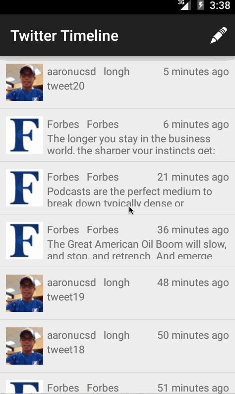

# Android CodePath Week3: My Simple Tweet app

Version 1.0

Overview: Build a simple Twitter client that supports viewing a Twitter timeline and composing a new tweet.

Time spent: 8 hours spent in total

Quick manual notes of app usage:

1) The following user stories must be completed:
- User can sign in to Twitter using OAuth login

- User can view the tweets from their home timeline

- User should be displayed the username, name, and body for each tweet
- User should be displayed the relative timestamp for each tweet "8m", "7h"
- User can view more tweets as they scroll with infinite pagination

2) User can compose a new tweet:
- User can click a “Compose” icon in the Action Bar on the top right
- User can then enter a new tweet and post this to twitter
- User is taken back to home timeline with new tweet visible in timeline

Animated gif walkthrough of this demo todo list app:

GIF created with [LiceCap](http://www.cockos.com/licecap/).
